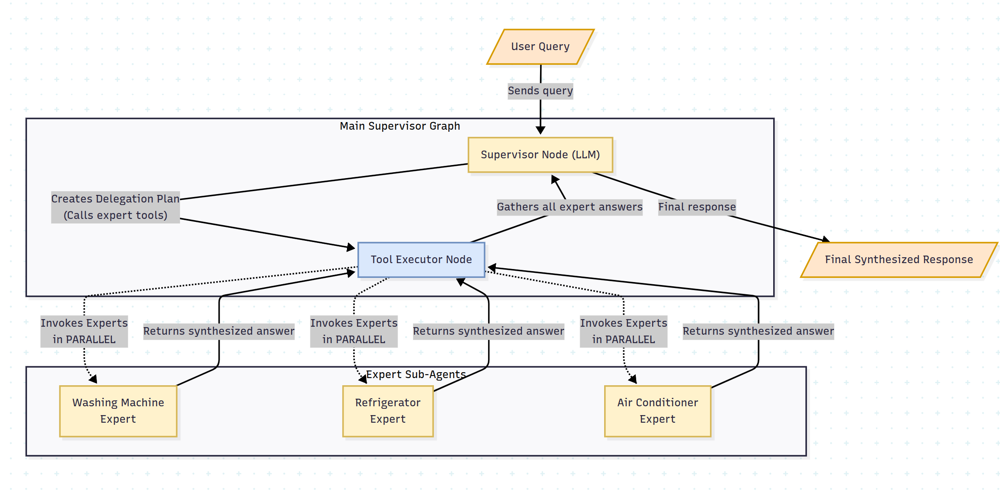
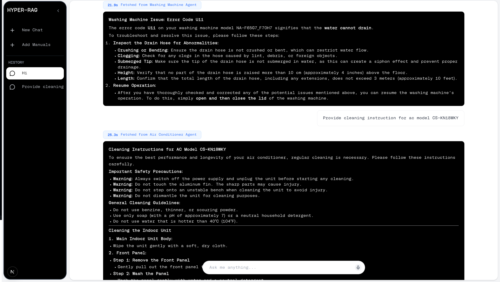

# Visual Guide - Multi-Agent RAG Pipeline

This guide provides a comprehensive visual walkthrough of the Multi-Agent RAG Pipeline system architecture, user interface, and data flows.

## Table of Contents

1. [User Interface Screenshots](#user-interface-screenshots)
2. [System Architecture Diagrams](#system-architecture-diagrams)
3. [Database Schema](#database-schema)
4. [Workflow Visualizations](#workflow-visualizations)

---

## User Interface Screenshots

### Main Chat Interface

**File**: `docs/ui-main-chat-interface.png`


**Features Shown**:
- ✨ Collapsible sidebar with "HYPER-RAG" branding
- 🆕 "New Chat" button for starting conversations
- 📚 "Add Manuals" button for document ingestion
- 📜 Chat history list in sidebar
- 💬 Main chat area with message input
- 🎨 Dark theme with modern UI design

---

### Agent Processing in Action

**File**: `docs/ui-agent-response-example.png`



**Features Shown**:
- 🔄 Real-time status updates ("Fetched from Washing Machine Agent")
- 🤖 Multi-agent response display
- ⏱️ Response time indicators (21.9s, 25.3s)
- 📝 Detailed agent responses with formatting
- 🎯 Agent attribution tags

**Example Query**: "Explain the error code U11 in the washing machine model NA-F65G7_F70H7"

**Response Shows**:
1. **Washing Machine Agent** providing detailed troubleshooting steps
2. **Air Conditioner Agent** providing cleaning instructions
3. Both responses formatted with markdown (bold, bullets, numbered lists)

---

### Multi-Agent Collaboration

**File**: `docs/ui-multi-agent-demo.png`



**Features Shown**:
- 🔵 "Running Agent Agent" status indicator
- ⏳ Loading spinner showing active processing
- 🤝 Multiple agents working together
- 📊 Clean, responsive interface design

**Demonstrates**: 
- Supervisor delegating to multiple expert agents
- Real-time agent status updates
- Asynchronous processing with visual feedback

---

### Manual Upload Interface

**File**: `docs/manual-upload-interface.png`


**Features Shown**:
- 📤 PDF upload interface
- 🗂️ Product type selection (washing_machine, refrigerator, air_conditioner)
- ✅ Upload progress and status
- 🔄 Ingestion pipeline visualization

**Use Case**: Adding new product manuals to the knowledge base

---

## System Architecture Diagrams

### 1. Document Ingestion Pipeline

**File**: `docs/architecture-ingestion-pipeline.png`


**Components**:

#### Frontend (Next.js)
- **User with PDF** → Initiates upload
- **PDF Upload UI** (`add-manuals.tsx`) → Handles file selection

#### Backend (FastAPI)
- **`/knowledge/upload/stream` API Endpoint** → Receives PDF
  - **HTTP POST Request** from frontend
  - **SSE Progress Stream** back to frontend
- **Ingestion Service** → Orchestrates processing
  - Invokes parsers
  - Manages vector storage

#### Data Processing
- **Hybrid PDF Parser (OCR)** → Extracts text and tables
  - Digital text extraction
  - OCR for scanned pages
  - Table detection
- **Gemini Embedding Model** → Creates vector embeddings
  - Converts text chunks to embeddings
  - Uses Google's embedding model

#### Data Stores
- **Product-Specific ChromaDB Vector Store** → Persists embeddings
  - Separate collections per product type
  - Efficient similarity search

**Data Flow**:
1. User uploads PDF → Frontend
2. Frontend sends to API → Backend
3. Backend processes PDF → Parser
4. Parser extracts text → Chunks
5. Chunks embedded → Gemini
6. Vectors stored → ChromaDB

---

### 2. Chat System Architecture

**File**: `docs/architecture-chat-system.png`


**Components**:

#### User Layer
- **User** sends message

#### Frontend (Next.js)
- **Chat UI** (`chat-view.tsx`) → Display interface
  - **HTTP POST Request** → Sends query
  - **Streams Response to User (SSE)** → Receives tokens

#### Backend (FastAPI)
- **`/chats/{id}/messages/stream` API Endpoint** → Handles queries
  - **Save User Message** (SQL INSERT)
  - **Load Conversation History** (SQL SELECT)
  - **Save AI Response** (SQL INSERT)
  - **Invoke Agent with History** → Calls agent system
  - **Returns History** → Provides context

#### Agent System
- **Hierarchical AI Agent Core** (`main_app`) → Supervisor + Sub-agents
  - Analyzes query
  - Delegates to experts
  - Synthesizes response
  - **Generates Final Response**

#### Data Stores
- **PostgreSQL Database (Long-Term Memory)** → Chat persistence
  - `chat_sessions` table
  - `chat_messages` table
- **ChromaDB Vector Stores (Knowledge Base)** → RAG context
  - **Sub-Agents Perform RAG** → Query vectors
  - **Returns Retrieved Context** → Relevant documents

**Data Flow**:
1. User sends message → Frontend
2. Frontend streams to API → Backend
3. Backend saves message → PostgreSQL
4. Backend loads history → PostgreSQL
5. Backend invokes agent → Agent Core
6. Agents query knowledge → ChromaDB
7. ChromaDB returns context → Agents
8. Agents generate response → Backend
9. Backend streams response → Frontend
10. Frontend displays to user

---

### 3. Agent Orchestration Flow

**File**: `docs/architecture-agent-orchestration.png`


**Components**:

#### Main Supervisor
- **User** sends query
- **Supervisor Node (LLM)** → Analyzes and delegates
  - **Creates Delegation Plan** → Decides which experts to call
  - **Gathers all expert answers** → Collects responses
  - **Synthesizes the final response** → Combines insights

#### Tool Execution
- **Tool Executor Node** → Manages expert invocations
  - **Invokes Experts** (can call multiple in parallel)
  - **Returns synthesized answer** from each expert

#### Expert Sub-Agents
Three specialized agents:
1. **Washing Machine Expert** → Washing machine queries
2. **Refrigerator Expert** → Refrigerator queries
3. **Air Conditioner Expert** → AC queries

Each expert:
- Receives delegation from supervisor
- Queries their specific knowledge base (ChromaDB)
- Returns domain-specific answer
- **Returns synthesized response** to supervisor

**Output**:
- **Final Synthesized Response** → Combined expert knowledge

**Flow Type**: Hierarchical delegation with parallel execution capability

---

### 4. Detailed Agent Graph Flow

**File**: (Same as above, alternate view)


**Key Concepts**:

#### Main Supervisor Graph
- **User Query** enters system
- **Supervisor Node (LLM)** makes routing decision
  - Uses Gemini Flash for fast routing
  - Analyzes query intent and domain
  - **Creates Delegation Plan** (calls expert tools)
  - **Final response** synthesis

#### Tool Executor Node
- Intermediate node between supervisor and experts
- **Invokes Experts in PARALLEL** when needed
- Manages tool execution lifecycle
- **Returns synthesized answer** to supervisor

#### Expert Sub-Agents
Each expert has:
- Dedicated RAG pipeline
- Product-specific ChromaDB collection
- Specialized prompts and context
- Independent execution

**Parallel Processing**:
- Multiple experts can be called simultaneously
- Reduces overall response time
- Enables comprehensive multi-domain answers

---

## Database Schema

**File**: `docs/database-schema-diagram.png`


### Tables Overview

#### `chat_sessions` Table
**Purpose**: Store conversation sessions

| Column      | Type          | Constraints | Description                |
|-------------|---------------|-------------|----------------------------|
| id          | uuid          | PRIMARY KEY | Unique session identifier  |
| title       | string        |             | Auto-generated title       |
| created_at  | timestamp     |             | Session creation time      |
| updated_at  | timestamp     |             | Last activity time         |

**Indexes**: Primary key on `id`

---

#### `chat_messages` Table
**Purpose**: Store individual messages with metadata

| Column         | Type          | Constraints | Description                    |
|----------------|---------------|-------------|--------------------------------|
| id             | bigserial     | PRIMARY KEY | Auto-incrementing message ID   |
| session_id     | uuid          | FOREIGN KEY | Links to chat_sessions.id      |
| sender         | string        |             | 'human' or 'ai'                |
| content        | text          |             | Message text                   |
| agent_name     | string        |             | Which agent responded          |
| time_consumed  | integer       |             | Response time (milliseconds)   |
| created_at     | timestamp     |             | Message timestamp              |

**Relationships**:
- `session_id` → `chat_sessions.id` (Foreign Key)
- One session has many messages (1:N relationship)

**Indexes**: 
- Primary key on `id`
- Foreign key index on `session_id`

---

### Database Features

✅ **ACID Compliance**: PostgreSQL ensures data integrity  
✅ **Foreign Key Constraints**: Maintain referential integrity  
✅ **Timestamps**: Track creation time for sessions and messages  
✅ **Performance Metrics**: Store agent name and response time  
✅ **Scalability**: BigSerial for high message volume  

---

## Workflow Visualizations

### Complete User Journey

#### 1. Document Upload Workflow

```
User → Upload PDF → Frontend UI
                        ↓
                   HTTP POST /knowledge/upload/stream
                        ↓
                   Backend API receives file
                        ↓
                   Ingestion Service processes
                        ↓
                   Hybrid PDF Parser extracts content
                        ↓
                   Text chunking + Table extraction
                        ↓
                   Gemini Embedding Model creates vectors
                        ↓
                   ChromaDB stores in product-specific collection
                        ↓
                   SSE streams progress to Frontend
                        ↓
                   User sees completion status
```

---

#### 2. Chat Query Workflow

```
User → Type question → Frontend Chat UI
                            ↓
                       HTTP POST /chats/{id}/messages/stream
                            ↓
                       Backend receives query + session_id
                            ↓
                       Save user message to PostgreSQL
                            ↓
                       Load conversation history from PostgreSQL
                            ↓
                       Invoke Supervisor Agent with context
                            ↓
            ┌───────────────┴──────────────┐
            ↓                              ↓
    Supervisor analyzes query      Loads conversation state
            ↓                              ↓
    Creates delegation plan        Maintains context
            ↓
    ┌───────┴────────┬──────────────┬──────────────┐
    ↓                ↓              ↓              ↓
Tool Executor    Expert 1      Expert 2      Expert 3
    ↓                ↓              ↓              ↓
Manages calls   Washing M.    Refrigerator    AC Expert
    ↓                ↓              ↓              ↓
Parallel exec   Queries DB    Queries DB    Queries DB
    ↓                ↓              ↓              ↓
                ChromaDB      ChromaDB      ChromaDB
                    ↓              ↓              ↓
                Retrieves     Retrieves     Retrieves
                context       context       context
                    ↓              ↓              ↓
                Generates     Generates     Generates
                answer        answer        answer
                    ↓              ↓              ↓
                Returns to Tool Executor ───────┘
                            ↓
                    Tool Executor collects all answers
                            ↓
                    Returns to Supervisor
                            ↓
                    Supervisor synthesizes final response
                            ↓
                    Streams tokens via SSE
                            ↓
                    Frontend displays real-time
                            ↓
                    User sees complete response
                            ↓
                    Backend saves AI message to PostgreSQL
                            ↓
                    Session updated in database
```

---

### Status Update Timeline

During query processing, the user sees these status updates in sequence:

1. **"Supervisor analyzing your question..."**
   - Supervisor node starts
   - Query analysis phase

2. **"Delegating to [Expert] Expert..."**
   - Tool call initiated
   - Specific agent selected

3. **"[Expert] Agent searching knowledge base..."**
   - Sub-agent node starts
   - RAG query to ChromaDB

4. **"Running [Expert] Agent..."**
   - Agent processing retrieved context
   - Generating response

5. **Token streaming**
   - Real-time word-by-word display
   - From supervisor's final synthesis

6. **Response complete**
   - Elapsed time shown (e.g., "21.9s")
   - Agent attribution displayed

---

## Technical Implementation Details

### Technologies Used

#### Frontend
- **Next.js 15** - React framework with App Router
- **React 19** - UI library with streaming support
- **TypeScript** - Type safety
- **Tailwind CSS** - Styling
- **Server-Sent Events (SSE)** - Real-time streaming

#### Backend
- **FastAPI** - Modern Python web framework
- **Uvicorn** - ASGI server
- **LangGraph** - Agent orchestration
- **LangChain** - LLM framework
- **Pydantic** - Data validation

#### AI/ML
- **Google Gemini 2.5 Flash** - Supervisor agent (fast routing)
- **Google Gemini 2.5 Pro** - Sub-agents (quality responses)
- **Gemini Embedding Model** - Vector embeddings
- **HuggingFace Sentence Transformers** - Alternative embeddings

#### Data Storage
- **PostgreSQL 16** - Relational database
- **ChromaDB 0.5.23** - Vector database
- **SQLAlchemy** - ORM

#### PDF Processing
- **PyMuPDF** - PDF text extraction
- **pdfplumber** - Table extraction
- **pytesseract** - OCR for scanned documents

---

## Visual Design Principles

### UI/UX Design

1. **Dark Theme**
   - Reduced eye strain
   - Modern aesthetic
   - High contrast for readability

2. **Real-Time Feedback**
   - Status indicators
   - Loading spinners
   - Progressive disclosure

3. **Hierarchical Layout**
   - Sidebar for navigation
   - Main content area for chat
   - Clear visual separation

4. **Responsive Design**
   - Mobile-friendly
   - Collapsible sidebar
   - Adaptive layouts

### Information Architecture

1. **Conversation Context**
   - Chronological message order
   - Clear sender identification (human/ai)
   - Persistent history in sidebar

2. **Agent Attribution**
   - Color-coded agent tags
   - Response time badges
   - Clear delegation flow

3. **Status Communication**
   - Progressive status updates
   - Non-blocking indicators
   - Clear success/error states

---

## Key Visual Elements

### Color Coding

- **Blue** - System actions, primary UI elements
- **Yellow/Gold** - User actions, input states
- **Green** - Success states, data stores
- **Purple/Lavender** - API endpoints, services
- **Gray** - Secondary actions, metadata

### Typography

- **Headers** - Bold, clear hierarchy
- **Body Text** - Readable font size
- **Code Blocks** - Monospace, syntax highlighted
- **Badges** - Small, distinct labels

### Iconography

- 🤖 - AI/Agent indicators
- ⏱️ - Time/performance metrics
- 📊 - Data/analytics
- 🔄 - Processing/loading
- ✅ - Success/completion

---

## Conclusion

This visual guide demonstrates the complete Multi-Agent RAG Pipeline system through:

✅ **User Interface** - Clean, modern chat experience  
✅ **Architecture** - Well-structured component diagram  
✅ **Data Flow** - Clear request/response pathways  
✅ **Agent System** - Hierarchical multi-agent orchestration  
✅ **Database Design** - Robust relational schema  
✅ **Processing Pipeline** - End-to-end document ingestion  

For implementation details, refer to:
- [Main README](README.md) - Complete setup guide
- [Docker Guide](DOCKER_GUIDE.md) - Container management
- [Backend README](backend/README.md) - API documentation

---

**All diagrams and screenshots are located in the `docs/` folder and are referenced throughout the main documentation.**
